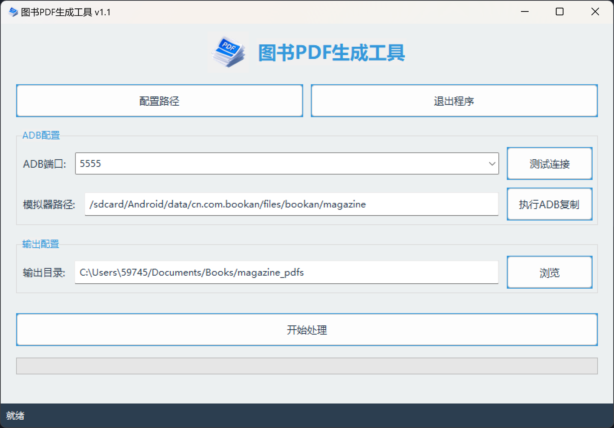
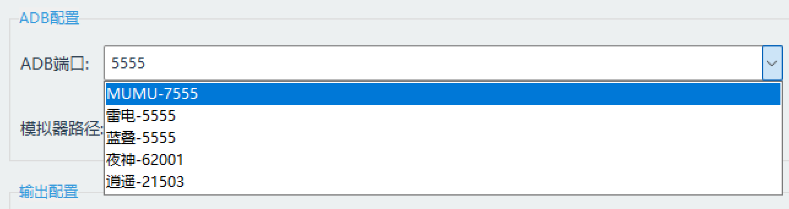

# 图书PDF生成工具

## 项目描述
这是一个用于从Android模拟器中提取杂志图片，并按指定顺序重命名后转换为PDF文件的工具。

## 功能特点
- ADB连接与文件传输
- 图片重命名与排序
- PDF文件生成
- 配置保存与加载

## 使用方法
1. 连接Android模拟器（支持MUMU/雷电/蓝叠/夜神/逍遥等模拟器）

2. 在ADB配置中设置模拟器中的杂志图片路径
3. 在输出配置中设置本地保存路径
4. 点击"执行ADB复制"按钮从模拟器获取图片
5. 点击"开始处理"按钮将图片转换为PDF文件

## 详细操作说明
1. 配置路径：
   - 点击"配置路径"按钮可修改源目录和目标目录
2. ADB连接：
   - 在ADB端口下拉框选择或输入端口号
   - 点击"手动测试"按钮测试连接
3. 文件处理：
   - "执行ADB复制"按钮：从模拟器复制图片到本地
   - "开始处理"按钮：将本地图片转换为PDF

## 配置说明
程序会自动保存配置到preferences.cfg文件中

## 作者
Mumei
版本: 1.1
日期: 2025-04-22