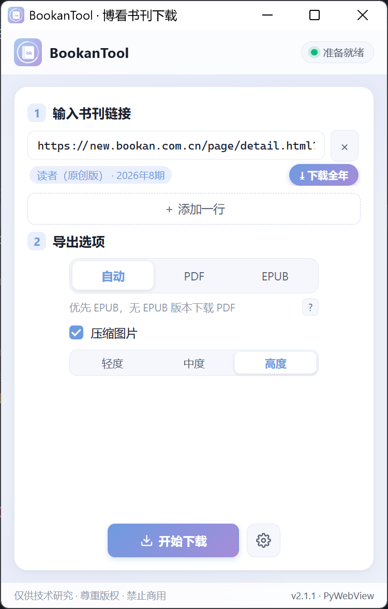
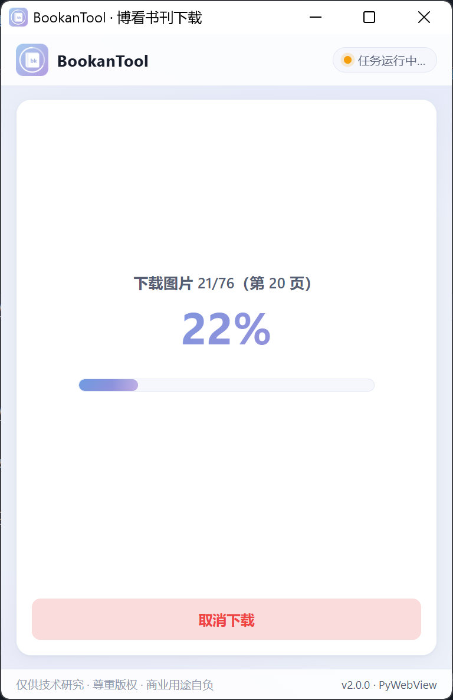
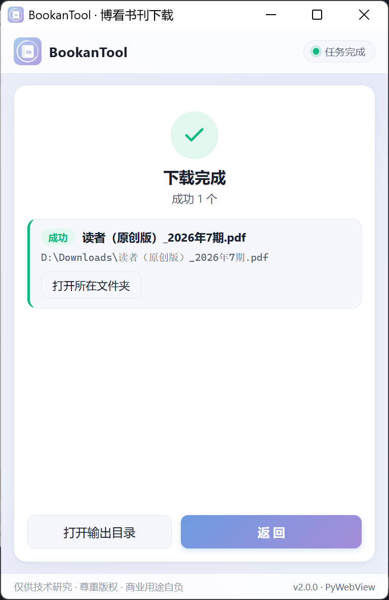

# BookanTool — 博看书刊下载工具

把「博看」网站上的杂志和书籍，一键下载成 **PDF** 或 **EPUB** 电子书，保存到自己的电脑上，随时翻阅、无需联网。

---

## 📷 界面预览

**主界面 —— 在这里粘贴书刊链接、选择导出格式**

![主界面]

**下载中 —— 实时显示进度百分比，随时可以取消**

![下载中]

**下载完成 —— 点击按钮即可打开文件所在的文件夹**

![下载完成] 

---

## 📖 使用教程

### 第一步：拿到书刊链接

1. 在「博看」网站 https://new.bookan.com.cn 中打开你想下载的杂志 / 书籍
2. 复制浏览器**地址栏的网址**

### 第二步：粘贴并选择格式

1. 把链接粘贴进主界面的输入框（点「＋ 添加一行」可增加更多链接）
2. 选择导出格式（滑动小滑块）：
   - **自动** —— 推荐，优先EPUB
   - **PDF** —— 图片版，和纸质版排版一致，文件较大
   - **EPUB** —— 文字版，文件小、可调字号
3. 两个可选项：
   - **压缩图片**（仅 PDF）：压缩文件，画质略降；轻度 / 中度 / 高度三档
   - **章节书签**：在 ⚙ 设置菜单里，建议保持开启

### 第三步：开始下载

1. 点击 **「开始下载」**
2. 等待下载完成（中途想停下，点「取消下载」）
3. 完成后点 **「打开输出目录」**，就能看到生成的 PDF / EPUB 文件

> 默认保存位置：`C:\Users\你的用户名\BookanTool\downloads\`
> 想换地方？在 ⚙ 设置菜单里修改「输出目录」。

---

## ❓ 常见问题

**Q：提示「链接无法识别」？**
确认复制的是博看网站的书刊详情页链接，而不是首页或搜索页。

**Q：下载到一半失败了？**
重新点「开始下载」再试一次；还不行就换一条链接测试，判断是不是这本书的问题。可在 ⚙ 设置 → 运行日志里查看原因。

**Q：EPUB 打不开？**
EPUB 需要阅读软件支持，手机推荐「微信读书」导入，电脑可用 Calibre。

---

## 📄 许可证

本项目以 [GPL-3.0](LICENSE) 协议开源。

作者：**Mumei** · 版本 2.0.0 · 更新于 2026-09-01
